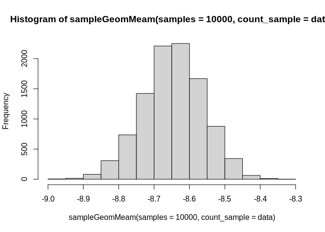
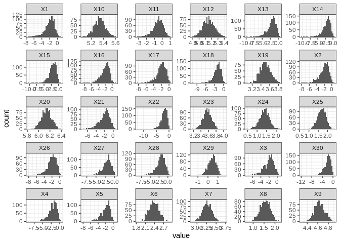

``` r
#devtools::install_github("thomazbastiaanssen/volatility")
library(tidyverse)
```

    ## ── Attaching packages ─────────────────────────────────────── tidyverse 1.3.1 ──

    ## ✔ ggplot2 3.4.0     ✔ purrr   0.3.4
    ## ✔ tibble  3.1.8     ✔ dplyr   1.0.9
    ## ✔ tidyr   1.2.0     ✔ stringr 1.4.0
    ## ✔ readr   2.1.2     ✔ forcats 0.5.1

    ## ── Conflicts ────────────────────────────────────────── tidyverse_conflicts() ──
    ## ✖ dplyr::filter() masks stats::filter()
    ## ✖ dplyr::lag()    masks stats::lag()

``` r
library(deleuze)
data = volatility::vola_genus_table$Validation_Pre_Control_2

b = log(sapply(data, FUN = function(x){sampleBetaBinom(samples = 1000, k = x, n = sum(data))}, simplify = T)) - sampleGeomMeam(samples = 1000, count_sample = data)


hist(sampleGeomMeam(samples = 10000, count_sample = data))
```

<!-- -->

``` r
b %>%
  data.frame() %>%
  mutate(sample = as.character(1:1000)) %>%
  pivot_longer(!sample) %>%
 
  filter(name %in% paste0("X", 1:30)) %>%
  ggplot() +
  aes(x = value) +
 
  geom_histogram() +
  facet_wrap(~name, scales = "free") +
  theme_bw()
```

    ## `stat_bin()` using `bins = 30`. Pick better value with `binwidth`.

<!-- -->
