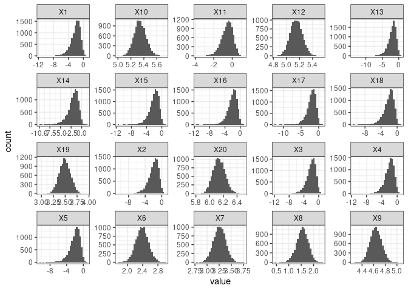
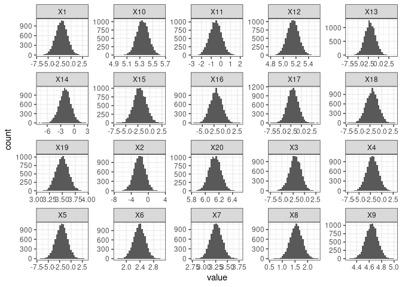

``` r
#devtools::install_github("thomazbastiaanssen/volatility")
library(tidyverse)
library(deleuze)
library(patchwork)
data = volatility::vola_genus_table$Validation_Pre_Control_2

data
```

    ##   [1]    0    0    0    0    0   47  114   20  453  915    2  757    0    0    0
    ##  [16]    0    0    0  144 2030    0    0  154   17   23    0    0    0    6    0
    ##  [31]    0    0    0    0    9   41    0    0    0    0    0    0    0   17    0
    ##  [46]   54  130    0    0    0    0  487    0    0    0   86    0  808  162    0
    ##  [61]    0    0 7547    0  242    0  364    0    0    0    0    0 1403    0   55
    ##  [76]   19    0    0    0    0  114   58  149    8    0    0    0    0   12    6
    ##  [91]    0  508    0  773    0    7    0    0    0  705    0  216  212  934   41
    ## [106]  188    0   95    0    0   95   63  111  564   75    0    0  147    0    0
    ## [121]    0    0    0    0   59    0    0    0    0    0    0    8    0    0    4
    ## [136] 3642    0

``` r
#To do: estimate parameters of geometric mean distribution. 
hist(sampleGeomMeam(samples = 10000, count_sample = data))
```

<!-- -->

``` r
#Notice that the zero-count features such as X13 have a much higher spread than high rollers like X7
sampleCLR(10000, data) %>%
  data.frame() %>%
  mutate(sample = as.character(1:10000)) %>%
  pivot_longer(!sample) %>%
  
  filter(name %in% paste0("X", 1:20)) %>%
  ggplot() +
  aes(x = value) +
  
  geom_histogram() +
  facet_wrap(~name, scales = "free") +
  theme_bw()
```

    ## `stat_bin()` using `bins = 30`. Pick better value with `binwidth`.

<!-- -->

``` r
sampleCLRApprox(samples = 10000, data) %>%
  data.frame() %>%
  mutate(sample = as.character(1:10000)) %>%
  pivot_longer(!sample) %>%
  
  filter(name %in% paste0("X", 1:20)) %>%
  ggplot() +
  aes(x = value) +
  
  geom_histogram() +
  facet_wrap(~name, scales = "free") +
  theme_bw()
```

    ## `stat_bin()` using `bins = 30`. Pick better value with `binwidth`.

<!-- -->

``` r
#Mean can be estimated:
#observed
mean(sampleGeomMeam(samples = 10000, count_sample = data, log_transformed = T))
```

    ## [1] -8.644966

``` r
#estimated
mean(getBetaMeans(data, log_transformed = T))
```

    ## [1] -8.645706

``` r
#As can the standard deviation:
#observed
sd(sampleGeomMeam(samples = 10000, count_sample = data, log_transformed = T))
```

    ## [1] 0.08729911

``` r
#estimated
#mean(sqrt(getBetaVars(data, log_transformed = T)))
sqrt(sum(getBetaVars(count_sample = data, log_transformed = T)) /  (length(data)* length(data)))
```

    ## [1] 0.0859221

``` r
#comparing the distributions
#observed
par(mfrow=c(1,2))
hist(sampleGeomMeam(samples = 10000, count_sample = data, log_transformed = T), xlim =c(-9.2, -8))

#estimated
hist(sampleGeomMeanApprox(samples = 10000, count_sample = data, log_transformed = T), xlim =c(-9.2,  -8))
```

<!-- -->

``` r
#Overlaid:
plot(density(sampleGeomMeam(samples = 10000, count_sample = data, log_transformed = T)), col = "red")

lines(density(sampleGeomMeanApprox(samples = 10000, count_sample = data, log_transformed = T)))
```

<!-- -->

``` r
#real sampled data
a = sampleCLR(10000, data) %>%
  data.frame() %>%
  mutate(sample = as.character(1:10000)) %>%
  pivot_longer(!sample) %>%
  
  filter(name %in% paste0("X", 1:20)) %>%
  mutate(type = "sampled")

#sampled from approximationdevtools::
b = sampleCLRApprox(samples = 10000, data) %>%
  data.frame() %>%
  mutate(sample = as.character(1:10000)) %>%
  pivot_longer(!sample) %>%
  
  filter(name %in% paste0("X", 1:20)) %>%
  
  mutate(type = "approx")

rbind(a, b) %>%
  filter(name %in% paste0("X", 1:10)) %>%
  ggplot() +
  aes(x = value) +
  
  geom_histogram() +
  facet_grid(type~name, scales = "free") +
  theme_bw()
```

    ## `stat_bin()` using `bins = 30`. Pick better value with `binwidth`.

<!-- -->

``` r
library(microbenchmark)
```

    ## Loading required package: microbenchmarkCore

    ## Registered S3 methods overwritten by 'microbenchmark':
    ##   method                 from              
    ##   print.microbenchmark   microbenchmarkCore
    ##   summary.microbenchmark microbenchmarkCore

``` r
mbm <- microbenchmark(
               "sample" = {
                 b <- sampleCLR(samples = 10000, data)
                 },
               "approx" = {
                 b <- sampleCLRApprox(samples = 10000, data)
                 })

mbm
```

    ## Unit: milliseconds
    ##    expr       min        lq     mean    median        uq      max neval cld
    ##  sample 361.15395 373.04984 434.1065 451.50079 466.99507 612.5255   100   b
    ##  approx  80.26496  84.35167  99.4112  86.41418  91.82672 209.6700   100  a
