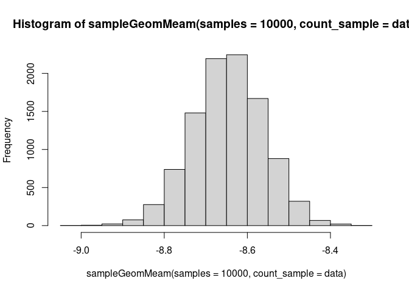

``` r
#devtools::install_github("thomazbastiaanssen/volatility")
library(tidyverse)
library(deleuze)
data = volatility::vola_genus_table$Validation_Pre_Control_2

data
```

    ##   [1]    0    0    0    0    0   47  114   20  453  915    2  757    0    0    0
    ##  [16]    0    0    0  144 2030    0    0  154   17   23    0    0    0    6    0
    ##  [31]    0    0    0    0    9   41    0    0    0    0    0    0    0   17    0
    ##  [46]   54  130    0    0    0    0  487    0    0    0   86    0  808  162    0
    ##  [61]    0    0 7547    0  242    0  364    0    0    0    0    0 1403    0   55
    ##  [76]   19    0    0    0    0  114   58  149    8    0    0    0    0   12    6
    ##  [91]    0  508    0  773    0    7    0    0    0  705    0  216  212  934   41
    ## [106]  188    0   95    0    0   95   63  111  564   75    0    0  147    0    0
    ## [121]    0    0    0    0   59    0    0    0    0    0    0    8    0    0    4
    ## [136] 3642    0

``` r
#To do: estimate parameters of geometric mean distribution. 
hist(sampleGeomMeam(samples = 10000, count_sample = data))
```

<!-- -->

``` r
#Notice that the zero-count features such as X13 have a much higher spread than high rollers like X7
sampleCLR(1000, data) %>%
  data.frame() %>%
  mutate(sample = as.character(1:1000)) %>%
  pivot_longer(!sample) %>%
  
  filter(name %in% paste0("X", 1:20)) %>%
  ggplot() +
  aes(x = value) +
  
  geom_histogram() +
  facet_wrap(~name, scales = "free") +
  theme_bw()
```

    ## `stat_bin()` using `bins = 30`. Pick better value with `binwidth`.

<!-- -->
