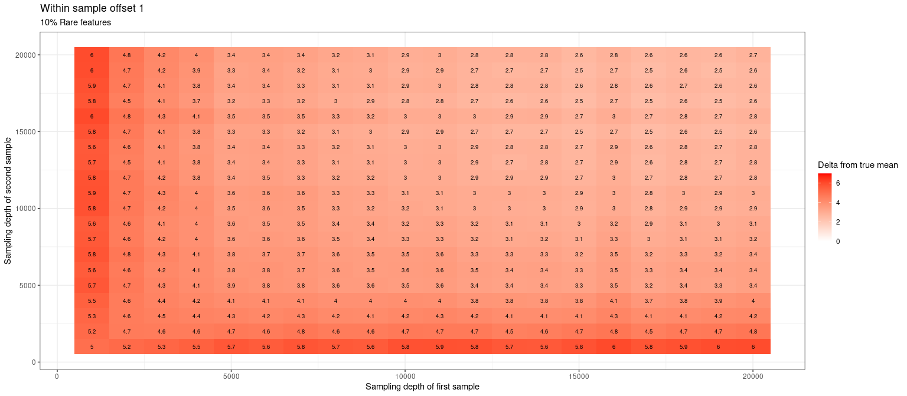
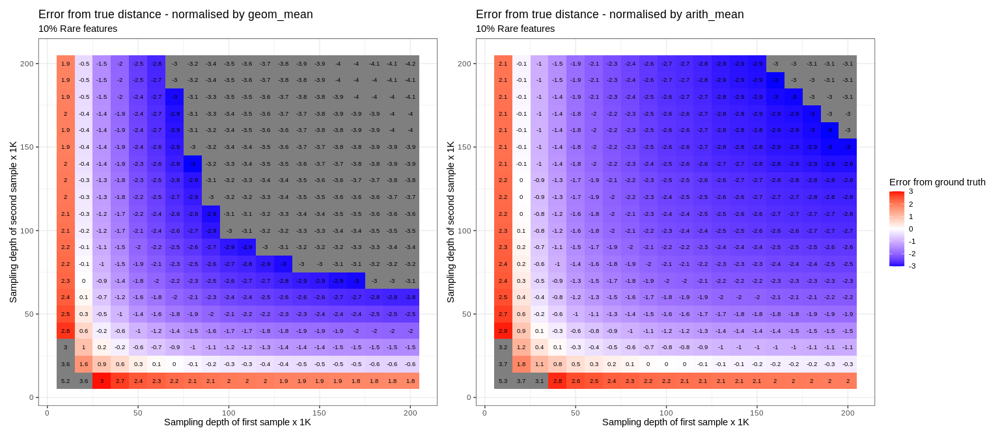
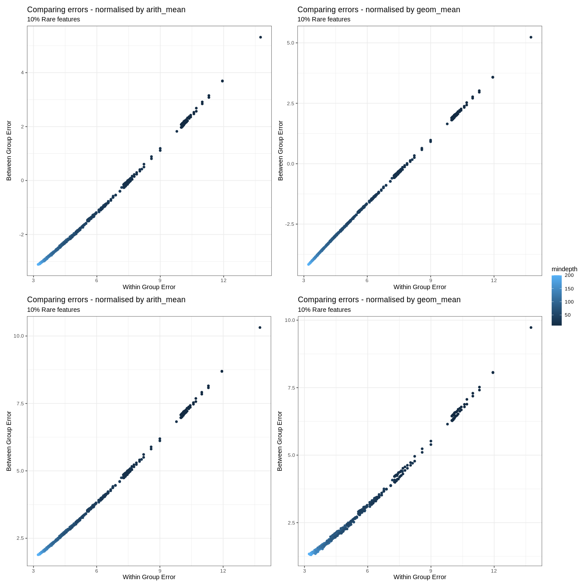

Maximally detectable Aitchison distance between samples from count data
may be bounded by  
1) number of features - because big distances require some features to
be proportionally very low, making them meaninglessly close to zero for
sampling purposes

2)  sequencing depth - more likely to have very low values be zero and
    thus indistinguishable from other very low values

This is likely not unique to Aitchison distance but rather due to the
nature of sampling.

q: can we determine maximum distance for a given depth and number of
features?

``` r
set.seed(12345)
library(tidyverse)
library(deleuze)
library(patchwork)
library(Tjazi)
library(vegan)
library(LaplacesDemon)

#Estimate distance
boot_dist <- function(X, n, dir_alpha, cl = NULL, verbose = T){
  
  X = as.matrix(X)
  stopifnot("bayes_boot_diff takes a matrix without zeroes" = !any(X==0))
  
  #Could be sped up with Rcpp:
  if(verbose){print("Bootstrapping...")}
  X.arr = replicate(n = n, X  * t(rdirichlet(ncol(X), alpha = rep(dir_alpha, nrow(X)))), simplify = "array")

  
  #CLR each iteration
  if(verbose){print("Applying CLR...")}  
  X.arr = apply(X = X.arr, MARGIN = 3, FUN = deleuze:::clr, simplify = "list")

  
  #Sum your list of matrices
  if(verbose){print("Collecting results...")} 
  X.arr = Reduce("+", X.arr)/n
  
  #Calculate the euclidean distance over the summed CLR-transformed matrix
  if(verbose){print("Computing distance...")}  
  out_mat = dist(t(X.arr), method = "euclidean", diag = T, upper = T)
  return(out_mat)
  
}

#Perturb a clr-transformed sample by a given distance
perturb_by <- function(x, by, prop = 1){
  
  #Which features to alter
  target = sample(1:length(x), max(2, round(length(x)*prop), digits = 0))
  
  #Generate container fro perturnbation
  res_perturb = vector(mode = "numeric", length = length(target))
  
  #Decide which features are going to be positive and negative
  division <- c(T, F, sample(c(T, F), size = length(target)-2, replace = T))
  
  #Distribute half of the squared distance to the positive division
  res_perturb[ division] =  sqrt(((by^2)/2)*(rdirichlet(n = 1, alpha = rep(1, sum(division)))))
  
  #Distribute half of the squared distance to the negative division
  res_perturb[!division] = -sqrt(((by^2)/2)*(rdirichlet(n = 1, alpha = rep(1, sum(!division)))))
  
  #Perturb the input
  x[target] = x[target] + res_perturb
  
  return(x)
}
```

``` r
b1  <-      rep(0.001, 1000)
b1a <-      b1 %>% {log(.) - mean(log(.))} %>% perturb_by(., by = 10) %>% {exp(.) / sum(exp(.))}
b1b <-      b1 %>% {log(.) - mean(log(.))} %>% perturb_by(., by = 20) %>% {exp(.) / sum(exp(.))}
b1c <-      b1 %>% {log(.) - mean(log(.))} %>% perturb_by(., by = 30) %>% {exp(.) / sum(exp(.))}
b1d <-      b1 %>% {log(.) - mean(log(.))} %>% perturb_by(., by = 40) %>% {exp(.) / sum(exp(.))}
b1e <-      b1 %>% {log(.) - mean(log(.))} %>% perturb_by(., by = 50) %>% {exp(.) / sum(exp(.))}

res_b1 = sapply(X = rep(seq(10000,200000, by = 10000), each = 10),FUN = function(x){
  table(factor(sample(paste0("feature_",1:length(b1)), 
                      prob = b1, 
                      replace = T, size = x), levels = paste0("feature_",1:length(b1))))
  
})

res_b1a = sapply(X = rep(seq(10000,200000, by = 10000), each = 10),FUN = function(x){
  table(factor(sample(paste0("feature_",1:length(b1)), 
                      prob = b1a, 
                      replace = T, size = x), levels = paste0("feature_",1:length(b1))))
  
})

res_b1b = sapply(X = rep(seq(10000,200000, by = 10000), each = 10),FUN = function(x){
  table(factor(sample(paste0("feature_",1:length(b1)), 
                      prob = b1b, 
                      replace = T, size = x), levels = paste0("feature_",1:length(b1))))
  
})

res_b1c = sapply(X = rep(seq(10000,200000, by = 10000), each = 10),FUN = function(x){
  table(factor(sample(paste0("feature_",1:length(b1)), 
                      prob = b1c, 
                      replace = T, size = x), levels = paste0("feature_",1:length(b1))))
  
})

res_b1d = sapply(X = rep(seq(10000,200000, by = 10000), each = 10),FUN = function(x){
  table(factor(sample(paste0("feature_",1:length(b1)), 
                      prob = b1d, 
                      replace = T, size = x), levels = paste0("feature_",1:length(b1))))
  
})

res_b1e = sapply(X = rep(seq(10000,200000, by = 10000), each = 10),FUN = function(x){
  table(factor(sample(paste0("feature_",1:length(b1)), 
                      prob = b1e, 
                      replace = T, size = x), levels = paste0("feature_",1:length(b1))))
  
})


res_b1_prob  <- getTableMeans(res_b1,  CLR_transformed = F)
res_b1a_prob <- getTableMeans(res_b1a, CLR_transformed = F)
res_b1b_prob <- getTableMeans(res_b1b, CLR_transformed = F)
res_b1c_prob <- getTableMeans(res_b1c, CLR_transformed = F)
res_b1d_prob <- getTableMeans(res_b1d, CLR_transformed = F)
res_b1e_prob <- getTableMeans(res_b1e, CLR_transformed = F)

data = as.data.frame(cbind(res_b1_prob, res_b1a_prob, res_b1b_prob, res_b1c_prob, res_b1d_prob, res_b1e_prob))

data.list = list(d10 = as.data.frame(cbind(res_b1_prob, res_b1a_prob)),
                 d20 = as.data.frame(cbind(res_b1_prob, res_b1b_prob)),
                 d30 = as.data.frame(cbind(res_b1_prob, res_b1c_prob)),
                 d40 = as.data.frame(cbind(res_b1_prob, res_b1d_prob)),
                 d50 = as.data.frame(cbind(res_b1_prob, res_b1e_prob)))
```

``` r
#This is very heavy & we only want to compare against res_b1_prob, so let's do it in chunks 
dist_l   <- lapply(data.list, FUN = function(x) {boot_dist(X = x, n = 1000, dir_alpha = 4)})
```

    ## [1] "Bootstrapping..."
    ## [1] "Applying CLR..."
    ## [1] "Collecting results..."
    ## [1] "Computing distance..."
    ## [1] "Bootstrapping..."
    ## [1] "Applying CLR..."
    ## [1] "Collecting results..."
    ## [1] "Computing distance..."
    ## [1] "Bootstrapping..."
    ## [1] "Applying CLR..."
    ## [1] "Collecting results..."
    ## [1] "Computing distance..."
    ## [1] "Bootstrapping..."
    ## [1] "Applying CLR..."
    ## [1] "Collecting results..."
    ## [1] "Computing distance..."
    ## [1] "Bootstrapping..."
    ## [1] "Applying CLR..."
    ## [1] "Collecting results..."
    ## [1] "Computing distance..."

``` r
#Wrangle to matrices
dist_l   <- lapply(dist_l, FUN = as.matrix)

#Collate to large rectangular distance matrix
est.dist <- do.call(cbind, dist_l)
```

``` r
dep <- rep(rep(seq(10,200, by = 10), each = 10), 10)
names(dep)         <- as.character(1:ncol(est.dist))
colnames(est.dist) <- as.character(1:ncol(est.dist))


long_dist1 = data.frame(as.matrix(est.dist)) %>% 
  rownames_to_column("ID") %>% 
  pivot_longer(!ID) %>% 
  
  filter(!str_detect(ID,"\\.")) %>% 
  mutate(ID = str_remove(ID, "X")) %>% 
  mutate(ID = str_remove(ID, "V")) %>% 
  
  
  mutate(name = str_remove(name, "\\.")) %>% 
  mutate(name = str_remove(name, "X")) %>% 
  mutate(name = str_remove(name, "V")) %>% 
  
  filter(as.numeric(ID)   < 201) %>% 
  filter(as.numeric(name) < 201) %>% 
  filter(name != ID) %>% 
  
  mutate(ID   = dep[ID]) %>% 
  mutate(name = dep[name]) %>% 
  group_by(ID,name) %>% 
  summarise(mean = mean(value),
            var  = var(value)) %>%
  ungroup()
```

    ## `summarise()` has grouped output by 'ID'. You can override using the `.groups`
    ## argument.

``` r
plot_dist1 <- long_dist1 %>% 
  ggplot() +
  aes(x = ID, y = name, fill = mean, label = round(mean, 1)) +
  
  geom_tile() +
  geom_text(colour = "black", size = 2.5) +
  scale_fill_gradient2(low = "blue", high = "red", mid = "white", midpoint = 0, limits = c(0,7), "Delta from true mean") +
  theme_bw() +
  ggtitle("Within sample offset 1", subtitle = "10% Rare features") +
  xlab("Sampling depth of first sample x 1K") +
  ylab("Sampling depth of second sample x 1K")

p_geom_mean <- data.frame(as.matrix(est.dist)) %>% 
  rownames_to_column("ID") %>% 
  pivot_longer(!ID) %>% 
  
  filter(!str_detect(ID,"\\.")) %>% 
  mutate(ID = str_remove(ID, "X")) %>% 
  mutate(ID = str_remove(ID, "V")) %>% 
  
  
  mutate(name = str_remove(name, "\\.")) %>% 
  mutate(name = str_remove(name, "X")) %>% 
  mutate(name = str_remove(name, "V")) %>% 
  
  filter(as.numeric(ID)   <= 201 & as.numeric(ID)   < 401) %>% 
  filter(as.numeric(name) >  201 & as.numeric(name) < 401) %>% 
  filter(name != ID) %>% 
  
  mutate(ID   = dep[ID]) %>% 
  mutate(name = dep[name]) %>% 
  group_by(ID,name) %>% 
  summarise(mean = mean(value),
            var  = var(value)) %>% 
  ungroup() %>% 
  mutate(mean_s = long_dist1$mean) %>% 
  mutate(mean_offset = sqrt((mean *  mean_s)) ) %>% 
  mutate(mean_from_10 = mean_offset - 10) %>% 
  
  ggplot() +
  aes(x = ID, y = name, fill = mean_from_10, label = round(mean_from_10, 1)) +
  
  geom_tile() +
  geom_text(colour = "black", size = 2.5) +
  scale_fill_gradient2(low = "blue", high = "red", mid = "white", midpoint = 0, limits = c(-3,3), "Error from ground truth") +
  theme_bw() +
  ggtitle("Error from true distance - normalised by geom_mean", subtitle = "10% Rare features") +
  xlab("Sampling depth of first sample x 1K") +
  ylab("Sampling depth of second sample x 1K")
```

    ## `summarise()` has grouped output by 'ID'. You can override using the `.groups`
    ## argument.

``` r
p_arith_mean <- data.frame(as.matrix(est.dist)) %>% 
  rownames_to_column("ID") %>% 
  pivot_longer(!ID) %>% 
  
  filter(!str_detect(ID,"\\.")) %>% 
  mutate(ID = str_remove(ID, "X")) %>% 
  mutate(ID = str_remove(ID, "V")) %>% 
  
  
  mutate(name = str_remove(name, "\\.")) %>% 
  mutate(name = str_remove(name, "X")) %>% 
  mutate(name = str_remove(name, "V")) %>% 
  
  filter(as.numeric(ID)   <= 201 & as.numeric(ID)   < 401) %>% 
  filter(as.numeric(name) >  201 & as.numeric(name) < 401) %>% 
  
  filter(name != ID) %>% 
  
  mutate(ID   = dep[ID]) %>% 
  mutate(name = dep[name]) %>% 
  group_by(ID,name) %>% 
  summarise(mean = mean(value),
            var  = var(value)) %>% 
  ungroup() %>% 
  mutate(mean_s = long_dist1$mean) %>% 
  mutate(mean_offset = (mean +  mean_s)/2 ) %>% 
  mutate(mean_from_10 = mean_offset - 10) %>% 
  
  ggplot() +
  aes(x = ID, y = name, fill = mean_from_10, label = round(mean_from_10, 1)) +
  
  geom_tile() +
  geom_text(colour = "black", size = 2.5) +
  scale_fill_gradient2(low = "blue", high = "red", mid = "white", midpoint = 0, limits = c(-3,3), "Error from ground truth") +
  theme_bw() +
  ggtitle("Error from true distance - normalised by arith_mean", subtitle = "10% Rare features") +
  xlab("Sampling depth of first sample x 1K") +
  ylab("Sampling depth of second sample x 1K")
```

    ## `summarise()` has grouped output by 'ID'. You can override using the `.groups`
    ## argument.

``` r
data.frame(as.matrix(est.dist)) %>% 
  rownames_to_column("ID") %>% 
  pivot_longer(!ID) %>% 
  
  filter(!str_detect(ID,"\\.")) %>% 
  mutate(ID = str_remove(ID, "X")) %>% 
  mutate(ID = str_remove(ID, "V")) %>% 
  
  
  mutate(name = str_remove(name, "\\.")) %>% 
  mutate(name = str_remove(name, "X")) %>% 
  mutate(name = str_remove(name, "V")) %>% 
  
  filter(as.numeric(ID)   <= 201 & as.numeric(ID)   < 401) %>% 
  filter(as.numeric(name) >  201 & as.numeric(name) < 401) %>% 
  filter(name != ID) %>% 
  
  mutate(ID   = dep[ID]) %>% 
  mutate(name = dep[name]) %>% 
  group_by(ID,name) %>% 
  summarise(mean = mean(value),
            var  = var(value)) %>% 
  ungroup() %>% 
  ggplot() +
  aes(x = ID, y = name, fill = mean, label = round(mean, 1)) +
  
  geom_tile() +
  geom_text(colour = "black", size = 2.5) +
  scale_fill_gradient2(low = "blue", high = "red", mid = "white", midpoint = 0, limits = c(0,30), "Estimated distance") +
  theme_bw() +
  ggtitle("Estimated distance, should be 10", subtitle = "10% Rare features") +
  xlab("Sampling depth of first sample x 1K") +
  ylab("Sampling depth of second sample x 1K")
```

    ## `summarise()` has grouped output by 'ID'. You can override using the `.groups`
    ## argument.

<!-- -->

``` r
data.frame(as.matrix(est.dist)) %>% 
  rownames_to_column("ID") %>% 
  pivot_longer(!ID) %>% 
  
  filter(!str_detect(ID,"\\.")) %>% 
  mutate(ID = str_remove(ID, "X")) %>% 
  mutate(ID = str_remove(ID, "V")) %>% 
  
  
  mutate(name = str_remove(name, "\\.")) %>% 
  mutate(name = str_remove(name, "X")) %>% 
  mutate(name = str_remove(name, "V")) %>% 
  
  filter(as.numeric(ID)   <= 201 & as.numeric(ID)   < 401 & as.numeric(ID)   < 601) %>% 
  filter(as.numeric(name) >  201 & as.numeric(name) > 401 & as.numeric(name) < 601) %>% 
  filter(name != ID) %>% 
  
  mutate(ID   = dep[ID]) %>% 
  mutate(name = dep[name]) %>% 
  group_by(ID,name) %>% 
  summarise(mean = mean(value),
            var  = var(value)) %>% 
  ungroup() %>% 
  ggplot() +
  aes(x = ID, y = name, fill = mean, label = round(mean, 1)) +
  
  geom_tile() +
  geom_text(colour = "black", size = 2.5) +
  scale_fill_gradient2(low = "blue", high = "red", mid = "white", midpoint = 0, limits = c(0,30), "Estimated distance") +
  theme_bw() +
  ggtitle("Estimated distance, should be 20", subtitle = "10% Rare features") +
  xlab("Sampling depth of first sample x 1K") +
  ylab("Sampling depth of second sample x 1K")
```

    ## `summarise()` has grouped output by 'ID'. You can override using the `.groups`
    ## argument.

<!-- -->

``` r
data.frame(as.matrix(est.dist)) %>% 
  rownames_to_column("ID") %>% 
  pivot_longer(!ID) %>% 
  
  filter(!str_detect(ID,"\\.")) %>% 
  mutate(ID = str_remove(ID, "X")) %>% 
  mutate(ID = str_remove(ID, "V")) %>% 
  
  
  mutate(name = str_remove(name, "\\.")) %>% 
  mutate(name = str_remove(name, "X")) %>% 
  mutate(name = str_remove(name, "V")) %>% 
  
  filter(as.numeric(ID)   <= 201 & as.numeric(ID)   < 601 & as.numeric(ID)   < 801) %>% 
  filter(as.numeric(name) >  201 & as.numeric(name) > 601 & as.numeric(name) < 801) %>% 
  filter(name != ID) %>% 
  
  mutate(ID   = dep[ID]) %>% 
  mutate(name = dep[name]) %>% 
  group_by(ID,name) %>% 
  summarise(mean = mean(value),
            var  = var(value)) %>% 
  ungroup() %>% 
  ggplot() +
  aes(x = ID, y = name, fill = mean, label = round(mean, 1)) +
  
  geom_tile() +
  geom_text(colour = "black", size = 2.5) +
  scale_fill_gradient2(low = "blue", high = "red", mid = "white", midpoint = 0, limits = c(0,30), "Estimated distance") +
  theme_bw() +
  ggtitle("Estimated distance, should be 30", subtitle = "10% Rare features") +
  xlab("Sampling depth of first sample x 1K") +
  ylab("Sampling depth of second sample x 1K")
```

    ## `summarise()` has grouped output by 'ID'. You can override using the `.groups`
    ## argument.

<!-- -->

``` r
data.frame(as.matrix(est.dist)) %>% 
  rownames_to_column("ID") %>% 
  pivot_longer(!ID) %>% 
  
  filter(!str_detect(ID,"\\.")) %>% 
  mutate(ID = str_remove(ID, "X")) %>% 
  mutate(ID = str_remove(ID, "V")) %>% 
  
  
  mutate(name = str_remove(name, "\\.")) %>% 
  mutate(name = str_remove(name, "X")) %>% 
  mutate(name = str_remove(name, "V")) %>% 
  
  filter(as.numeric(ID)   <= 201 & as.numeric(ID)   < 801 & as.numeric(ID)   < 1001) %>% 
  filter(as.numeric(name) >  201 & as.numeric(name) > 801 & as.numeric(name) < 1001) %>% 
  filter(name != ID) %>% 
  
  mutate(ID   = dep[ID]) %>% 
  mutate(name = dep[name]) %>% 
  group_by(ID,name) %>% 
  summarise(mean = mean(value),
            var  = var(value)) %>% 
  ungroup() %>% 
  ggplot() +
  aes(x = ID, y = name, fill = mean, label = round(mean, 1)) +
  
  geom_tile() +
  geom_text(colour = "black", size = 2.5) +
  scale_fill_gradient2(low = "blue", high = "red", mid = "white", midpoint = 0, limits = c(0,30), "Estimated distance") +
  theme_bw() +
  ggtitle("Estimated distance, should be 40", subtitle = "10% Rare features") +
  xlab("Sampling depth of first sample x 1K") +
  ylab("Sampling depth of second sample x 1K")
```

    ## `summarise()` has grouped output by 'ID'. You can override using the `.groups`
    ## argument.

<!-- -->

``` r
data.frame(as.matrix(est.dist)) %>% 
  rownames_to_column("ID") %>% 
  pivot_longer(!ID) %>% 
  
  filter(!str_detect(ID,"\\.")) %>% 
  mutate(ID = str_remove(ID, "X")) %>% 
  mutate(ID = str_remove(ID, "V")) %>% 
  
  
  mutate(name = str_remove(name, "\\.")) %>% 
  mutate(name = str_remove(name, "X")) %>% 
  mutate(name = str_remove(name, "V")) %>% 
  
  filter(as.numeric(ID)   <= 201 & as.numeric(ID)   < 1001 & as.numeric(ID)   < 1201) %>% 
  filter(as.numeric(name) >  201 & as.numeric(name) > 1001 & as.numeric(name) < 1201) %>% 
  filter(name != ID) %>% 
  
  mutate(ID   = dep[ID]) %>% 
  mutate(name = dep[name]) %>% 
  group_by(ID,name) %>% 
  summarise(mean = mean(value),
            var  = var(value)) %>% 
  ungroup() %>% 
  ggplot() +
  aes(x = ID, y = name, fill = mean, label = round(mean, 1)) +
  
  geom_tile() +
  geom_text(colour = "black", size = 2.5) +
  scale_fill_gradient2(low = "blue", high = "red", mid = "white", midpoint = 0, limits = c(0,30), "Estimated distance") +
  theme_bw() +
  ggtitle("Estimated distance, should be 50", subtitle = "10% Rare features") +
  xlab("Sampling depth of first sample x 1K") +
  ylab("Sampling depth of second sample x 1K")
```

    ## `summarise()` has grouped output by 'ID'. You can override using the `.groups`
    ## argument.

<!-- -->

``` r
data.frame(as.matrix(est.dist)) %>% 
  rownames_to_column("ID") %>% 
  pivot_longer(!ID) %>% 
  
  filter(!str_detect(ID,"\\.")) %>% 
  mutate(ID = str_remove(ID, "X")) %>% 
  mutate(ID = str_remove(ID, "V")) %>% 
  
  
  mutate(name = str_remove(name, "\\.")) %>% 
  mutate(name = str_remove(name, "X")) %>% 
  mutate(name = str_remove(name, "V")) %>% 
  
  filter(as.numeric(ID)   <= 201 & as.numeric(ID)   < 401) %>% 
  filter(as.numeric(name) >  201 & as.numeric(name) < 401) %>% 
  filter(name != ID) %>% 
  
  mutate(ID   = dep[ID]) %>% 
  mutate(name = dep[name]) %>% 
  group_by(ID,name) %>% 
  summarise(mean = mean(value),
            var  = var(value)) %>% 
  ungroup() %>% 
  mutate(mean_s = long_dist1$mean) %>% 
  #mutate(mean_offset = sqrt((mean *  mean_s)) ) %>% 
  mutate(mean_from_10 = mean - 10) %>% 
  
  ggplot() +
  aes(x = ID, y = name, fill = mean_from_10, label = round(mean_from_10, 1)) +
  
  geom_tile() +
  geom_text(colour = "black", size = 2.5) +
  scale_fill_gradient2(low = "blue", high = "red", mid = "white", midpoint = 0, limits = c(-3,3), "Error from ground truth") +
  theme_bw() +
  ggtitle("Error from true distance", subtitle = "10% Rare features") +
  xlab("Sampling depth of first sample x 1K") +
  ylab("Sampling depth of second sample x 1K")
```

    ## `summarise()` has grouped output by 'ID'. You can override using the `.groups`
    ## argument.

<!-- -->

``` r
#Let's see if we can find out where this bias comes from.
plot_dist1
```

<!-- -->

``` r
p_geom_mean + p_arith_mean + plot_layout(guides = 'collect')
```

<!-- -->

``` r
cora <- data.frame(as.matrix(est.dist)) %>% 
  rownames_to_column("ID") %>% 
  pivot_longer(!ID) %>% 
  
  filter(!str_detect(ID,"\\.")) %>% 
  mutate(ID = str_remove(ID, "X")) %>% 
  mutate(ID = str_remove(ID, "V")) %>% 
  
  
  mutate(name = str_remove(name, "\\.")) %>% 
  mutate(name = str_remove(name, "X")) %>% 
  mutate(name = str_remove(name, "V")) %>% 
  
  filter(as.numeric(ID)   <= 201 & as.numeric(ID)   < 401) %>% 
  filter(as.numeric(name) >  201 & as.numeric(name) < 401) %>% 
  filter(name != ID) %>% 
  
  mutate(ID   = dep[ID]) %>% 
  mutate(name = dep[name]) %>% 
  group_by(ID,name) %>% 
  summarise(mean = mean(value),
            var  = var(value)) %>% 
  ungroup() %>% 
  mutate(mean_s = long_dist1$mean) %>% 
  mutate(mean_offset = (mean +  mean_s)/2 ) %>% 
  mutate(mean_from_10 = mean_offset - 10) %>% 
  mutate(mindepth = pmin(ID, name)) %>% 
  
  ggplot() +
  aes(x = mean_s, y = mean_from_10, colour = mindepth) +
  
  geom_point() +
  theme_bw() +
  ggtitle("Comparing errors - normalised by arith_mean", subtitle = "10% Rare features") +
  xlab("Within Group Error") +
  ylab("Between Group Error")
```

    ## `summarise()` has grouped output by 'ID'. You can override using the `.groups`
    ## argument.

``` r
corg <- data.frame(as.matrix(est.dist)) %>% 
  rownames_to_column("ID") %>% 
  pivot_longer(!ID) %>% 
  
  filter(!str_detect(ID,"\\.")) %>% 
  mutate(ID = str_remove(ID, "X")) %>% 
  mutate(ID = str_remove(ID, "V")) %>% 
  
  
  mutate(name = str_remove(name, "\\.")) %>% 
  mutate(name = str_remove(name, "X")) %>% 
  mutate(name = str_remove(name, "V")) %>% 
  
  filter(as.numeric(ID)   <= 201 & as.numeric(ID)   < 401) %>% 
  filter(as.numeric(name) >  201 & as.numeric(name) < 401) %>% 
  filter(name != ID) %>% 
  
  mutate(ID   = dep[ID]) %>% 
  mutate(name = dep[name]) %>% 
  group_by(ID,name) %>% 
  summarise(mean = mean(value),
            var  = var(value)) %>% 
  ungroup() %>% 
  mutate(mean_s = long_dist1$mean) %>% 
  mutate(mean_offset = sqrt((mean *  mean_s)) ) %>% 
  mutate(mean_from_10 = mean_offset - 10) %>% 
  mutate(mindepth = pmin(ID, name)) %>% 
  
  ggplot() +
  aes(x = mean_s, y = mean_from_10, colour = mindepth) +
  
  geom_point() +
  theme_bw() +
  ggtitle("Comparing errors - normalised by geom_mean", subtitle = "10% Rare features") +
  xlab("Within Group Error") +
  ylab("Between Group Error")
```

    ## `summarise()` has grouped output by 'ID'. You can override using the `.groups`
    ## argument.

``` r
corc <- data.frame(as.matrix(est.dist)) %>% 
  rownames_to_column("ID") %>% 
  pivot_longer(!ID) %>% 
  
  filter(!str_detect(ID,"\\.")) %>% 
  mutate(ID = str_remove(ID, "X")) %>% 
  mutate(ID = str_remove(ID, "V")) %>% 
  
  
  mutate(name = str_remove(name, "\\.")) %>% 
  mutate(name = str_remove(name, "X")) %>% 
  mutate(name = str_remove(name, "V")) %>% 
  
  filter(as.numeric(ID)   <= 201 & as.numeric(ID)   < 401) %>% 
  filter(as.numeric(name) >  201 & as.numeric(name) < 401) %>% 
  filter(name != ID) %>% 
  
  mutate(ID   = dep[ID]) %>% 
  mutate(name = dep[name]) %>% 
  group_by(ID,name) %>% 
  summarise(mean = mean(value),
            var  = var(value)) %>% 
  ungroup() %>% 
  mutate(mean_s = long_dist1$mean) %>% 

  mutate(mean_offset = ((mean - 10 ) +  mean_s)/2 ) %>% 
  mutate(mean_from_10 = mean_offset) %>% 
  mutate(mindepth = pmin(ID, name)) %>% 
  
  ggplot() +
  aes(x = mean_s, y = mean_from_10, colour = mindepth) +
  
  geom_point() +
  theme_bw() +
  ggtitle("Comparing errors - normalised by arith_mean", subtitle = "10% Rare features") +
  xlab("Within Group Error") +
  ylab("Between Group Error")
```

    ## `summarise()` has grouped output by 'ID'. You can override using the `.groups`
    ## argument.

``` r
cord <- data.frame(as.matrix(est.dist)) %>% 
  rownames_to_column("ID") %>% 
  pivot_longer(!ID) %>% 
  
  filter(!str_detect(ID,"\\.")) %>% 
  mutate(ID = str_remove(ID, "X")) %>% 
  mutate(ID = str_remove(ID, "V")) %>% 
  
  
  mutate(name = str_remove(name, "\\.")) %>% 
  mutate(name = str_remove(name, "X")) %>% 
  mutate(name = str_remove(name, "V")) %>% 
  
  filter(as.numeric(ID)   <= 201 & as.numeric(ID)   < 401) %>% 
  filter(as.numeric(name) >  201 & as.numeric(name) < 401) %>% 
  filter(name != ID) %>% 
  
  mutate(ID   = dep[ID]) %>% 
  mutate(name = dep[name]) %>% 
  group_by(ID,name) %>% 
  summarise(mean = mean(value),
            var  = var(value)) %>% 
  ungroup() %>% 
  mutate(mean_s = long_dist1$mean) %>% 

  mutate(mean_offset = sqrt(((mean - 10) *  mean_s)) ) %>% 
  mutate(mean_from_10 = mean_offset) %>% 
  mutate(mindepth = pmin(ID, name)) %>% 
  
  ggplot() +
  aes(x = mean_s, y = mean_from_10, colour = mindepth) +
  
  geom_point() +
  theme_bw() +
  ggtitle("Comparing errors - normalised by geom_mean", subtitle = "10% Rare features") +
  xlab("Within Group Error") +
  ylab("Between Group Error")
```

    ## `summarise()` has grouped output by 'ID'. You can override using the `.groups`
    ## argument.

``` r
(cora + corg) /
  (corc  + cord)+ plot_layout(guides = 'collect')
```

<!-- -->

``` r
data.frame(as.matrix(est.dist)) %>% 
  rownames_to_column("ID") %>% 
  pivot_longer(!ID) %>% 
  
  filter(!str_detect(ID,"\\.")) %>% 
  mutate(ID = str_remove(ID, "X")) %>% 
  mutate(ID = str_remove(ID, "V")) %>% 
  
  
  mutate(name = str_remove(name, "\\.")) %>% 
  mutate(name = str_remove(name, "X")) %>% 
  mutate(name = str_remove(name, "V")) %>% 
  
  filter(as.numeric(ID)   <= 201 & as.numeric(ID)   < 401) %>% 
  filter(as.numeric(name) >  201 & as.numeric(name) < 401) %>% 
  filter(name != ID) %>% 
  
  mutate(ID   = dep[ID]) %>% 
  mutate(name = dep[name]) %>% 
  group_by(ID,name) %>% 
  summarise(mean = mean(value),
            var  = var(value)) %>% 
  ungroup() %>% 
  
  mutate(mean_s = long_dist1$mean) %>% 

  mutate(mean_s = mean_s * coefficients(lm(mean~mean_s))[2]) %>% 

 # mutate(mean_offset = sqrt((mean *  mean_s)) ) %>% 
 
  mutate(mean_offset = (mean - mean_s) ) %>% 
  #mutate(of)
 #  .$mean_offset %>% mean
  #mutate(mean_offset = mean_offset - 10*0.85) %>% 

  #mutate(mean_from_10 = mean_offset - 10*0.85) %>% 
  
  mutate(mean_from_10 = mean_offset - 10) %>% 
  
  mutate(mindepth = pmin(ID, name)) %>% 
  
  ggplot() +
  aes(x = mean_s, y = mean_from_10, colour = mindepth) +
  
  geom_point() +
  geom_smooth(method = "lm") +
  theme_bw() +
  ggtitle("Comparing errors - normalised by arith_mean", subtitle = "10% Rare features") +
  xlab("Within Group Error") +
  ylab("Between Group Error")
```

    ## `summarise()` has grouped output by 'ID'. You can override using the `.groups`
    ## argument.
    ## `geom_smooth()` using formula = 'y ~ x'

    ## Warning: The following aesthetics were dropped during statistical transformation: colour
    ## ℹ This can happen when ggplot fails to infer the correct grouping structure in
    ##   the data.
    ## ℹ Did you forget to specify a `group` aesthetic or to convert a numerical
    ##   variable into a factor?

<!-- -->

``` r
data.frame(as.matrix(est.dist)) %>% 
  rownames_to_column("ID") %>% 
  pivot_longer(!ID) %>% 
  
  filter(!str_detect(ID,"\\.")) %>% 
  mutate(ID = str_remove(ID, "X")) %>% 
  mutate(ID = str_remove(ID, "V")) %>% 
  
  
  mutate(name = str_remove(name, "\\.")) %>% 
  mutate(name = str_remove(name, "X")) %>% 
  mutate(name = str_remove(name, "V")) %>% 
  
  filter(as.numeric(ID)   <= 201 & as.numeric(ID)   < 401) %>% 
  filter(as.numeric(name) >  201 & as.numeric(name) < 401) %>% 
  filter(name != ID) %>% 
  
  mutate(ID   = dep[ID]) %>% 
  mutate(name = dep[name]) %>% 
  group_by(ID,name) %>% 
  summarise(mean = mean(value),
            var  = var(value)) %>% 
  ungroup() %>% 
  
  mutate(mean_s = long_dist1$mean) %>% 

  mutate(mean_c = mean_s * coefficients(lm(mean~mean_s))[2]) %>% 

  mutate(mean_offset = (mean - mean_c) ) %>% 
  
  mutate(mean_from_10 = mean_offset - 10) %>% 
  
  mutate(mindepth = pmin(ID, name)) %>% 
  
  ggplot() +
  aes(x = ID, y = name, fill = mean_from_10, label = round(mean_from_10, 1)) +
  
  geom_tile() +
  geom_text(colour = "black", size = 2.5) +
  scale_fill_gradient2(low = "blue", high = "red", mid = "white", midpoint = 0, limits = c(-1.5,1.5), "Delta from true mean") +
  theme_bw() +
  ggtitle("Error from true distance after regressing out within-sample error", subtitle = "10% Rare features") +
  xlab("Sampling depth of first sample x 1K") +
  ylab("Sampling depth of second sample x 1K")
```

    ## `summarise()` has grouped output by 'ID'. You can override using the `.groups`
    ## argument.

<!-- -->
