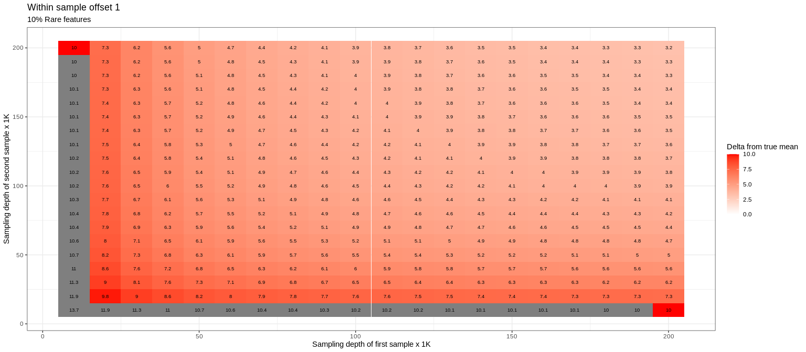

``` r
set.seed(12345)
library(tidyverse)
library(deleuze)
library(patchwork)
library(Tjazi)
library(vegan)
library(LaplacesDemon)


#Estimate distance
boot_dist <- function(X, n, dir_alpha, cl = NULL){
  
  X = as.matrix(X)
  stopifnot("bayes_boot_diff takes a matrix without zeroes" = !any(X==0))
  
  #Could be sped up with Rcpp:
  X.arr = replicate(n = n, X  * t(rdirichlet(ncol(X), alpha = rep(dir_alpha, nrow(X)))), simplify = "array")
  
  #CLR each iteration
  X.arr = apply(X = X.arr, MARGIN = 3, FUN = deleuze:::clr, simplify = "list")
  
  #Sum your list of matrices
  X.arr = Reduce("+", X.arr)/n
  
  #Calculate the euclidean distance over the summed CLR-transformed matrix
  out_mat = dist(t(X.arr), method = "euclidean", diag = T, upper = T)
  
  return(out_mat)
  
}
```

``` r
b1  <-      c(rep(1, 10), rep(5, 20), rep(15, 20), rep(40, 20), rep(80, 20), rep(100, 5), rep(250, 5) )
b1a <- b1 * c(rep(1, 10), rep(exp(1), 10), rep(1, 10),  rep(1/exp(1), 10), rep(1, 60) ) 

res_b1 = sapply(X = rep(seq(1000,20000, by = 1000), each = 10),FUN = function(x){
  table(factor(sample(paste0("feature_",1:100), 
                      prob = b1, 
                      replace = T, size = x), levels = paste0("feature_",1:100)))
  
})

res_b1a = sapply(X = rep(seq(1000,20000, by = 1000), each = 10),FUN = function(x){
  table(factor(sample(paste0("feature_",1:100), 
                      prob = b1a, 
                      replace = T, size = x), levels = paste0("feature_",1:100)))
  
})


res_b1_prob  <- getTableMeans(res_b1,  CLR_transformed = F)
res_b1a_prob <- getTableMeans(res_b1a, CLR_transformed = F)

data = as.data.frame(cbind(res_b1_prob, res_b1a_prob))
```

``` r
est.dist <- boot_dist(X = data, n = 1000, dir_alpha = 4)
```

``` r
dep <- rep(rep(seq(1000,20000, by = 1000), each = 10), 2)
names(dep) <- as.character(1:400)      

long_dist1 = data.frame(as.matrix(est.dist)) %>% 
  rownames_to_column("ID") %>% 
  pivot_longer(!ID) %>% 
  
  filter(!str_detect(ID,"\\.")) %>% 
  mutate(ID = str_remove(ID, "X")) %>% 
  mutate(ID = str_remove(ID, "V")) %>% 
  
  
  mutate(name = str_remove(name, "\\.")) %>% 
  mutate(name = str_remove(name, "X")) %>% 
  mutate(name = str_remove(name, "V")) %>% 
  
  filter(as.numeric(ID)   >= 201) %>% 
  filter(as.numeric(name) >= 201) %>% 
  filter(name != ID) %>% 
  
  mutate(ID   = dep[ID]) %>% 
  mutate(name = dep[name]) %>% 
  group_by(ID,name) %>% 
  summarise(mean = mean(value),
            var  = var(value)) %>%
  ungroup()
```

    ## `summarise()` has grouped output by 'ID'. You can override using the `.groups`
    ## argument.

``` r
plot_dist1 <- long_dist1 %>% 
  ggplot() +
  aes(x = ID, y = name, fill = mean, label = round(mean, 1)) +
  
  geom_tile() +
  geom_text(colour = "black", size = 2.5) +
  scale_fill_gradient2(low = "blue", high = "red", mid = "white", midpoint = 0, limits = c(0,7), "Delta from true mean") +
  theme_bw() +
  ggtitle("Within sample offset 1", subtitle = "10% Rare features") +
  xlab("Sampling depth of first sample") +
  ylab("Sampling depth of second sample")

long_dist2 = data.frame(as.matrix(est.dist)) %>% 
  rownames_to_column("ID") %>% 
  pivot_longer(!ID) %>% 
  
  filter(!str_detect(ID,"\\.")) %>% 
  mutate(ID = str_remove(ID, "X")) %>% 
  mutate(ID = str_remove(ID, "V")) %>% 
  
  
  mutate(name = str_remove(name, "\\.")) %>% 
  mutate(name = str_remove(name, "X")) %>% 
  mutate(name = str_remove(name, "V")) %>% 
  
  filter(as.numeric(ID)   < 201) %>% 
  filter(as.numeric(name) < 201) %>% 
  filter(name != ID) %>% 
  
  mutate(ID   = dep[ID]) %>% 
  mutate(name = dep[name]) %>% 
  group_by(ID,name) %>% 
  summarise(mean = mean(value),
            var  = var(value)) %>% 
  ungroup()
```

    ## `summarise()` has grouped output by 'ID'. You can override using the `.groups`
    ## argument.

``` r
plot_dist2 <- long_dist2 %>% 
  ggplot() +
  aes(x = ID, y = name, fill = mean, label = round(mean, 1)) +
  
  geom_tile() +
  geom_text(colour = "black", size = 2.5) +
  scale_fill_gradient2(low = "blue", high = "red", mid = "white", midpoint = 0, limits = c(0,7), "Delta from true mean") +
  theme_bw() +
  ggtitle("Within sample offset 2", subtitle = "10% Rare features") +
  xlab("Sampling depth of first sample") +
  ylab("Sampling depth of second sample")


long_dist2 %>% 
  mutate(mean2 = long_dist1$mean) %>% 
  mutate(diff_mean = mean - mean2) %>% 
  ggplot() +
  aes(x = ID, y = name, fill = diff_mean, label = round(diff_mean, 2)) +
  
  geom_tile() +
  geom_text(colour = "black", size = 2.5) +
  scale_fill_gradient2(low = "blue", high = "red", mid = "white", midpoint = 0, limits = c(-1,1), "Delta from true mean") +
  theme_bw() +
  ggtitle("Offset is not strongly dependent composition", subtitle = "10% Rare features") +
  xlab("Sampling depth of first sample") +
  ylab("Sampling depth of second sample")
```

<!-- -->

``` r
long_dist2 %>% 
  mutate(mean2 = long_dist1$mean) %>% 
  mutate(diff_mean = mean - mean2) %>%
  .$diff_mean %>% 
  hist(., breaks = 30)
```

<!-- -->

``` r
plot_dist1 + plot_dist2 + plot_layout(guides = 'collect')
```

<!-- -->
