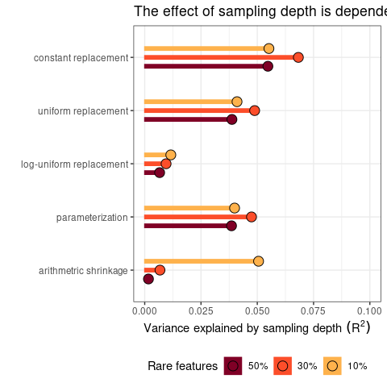

``` r
set.seed(12345)
library(tidyverse)
library(deleuze)
library(patchwork)
library(Tjazi)
library(vegan)
```

``` r
set.seed(12345)
b1 <- c(rep(1, 10), rep(5, 20), rep(15, 20), rep(40, 20), rep(80, 20), rep(100, 5), rep(250, 5) )
b2 <- c(rep(1, 30), rep(5, 15), rep(15, 15), rep(40, 15), rep(80, 15), rep(100, 5), rep(350, 5) )
b3 <- c(rep(1, 50), rep(5, 10), rep(15, 10), rep(40, 10), rep(80, 10), rep(100, 5), rep(450, 5) )


res_b1 = sapply(X = rep(seq(1000,20000, by = 1000), each = 100),FUN = function(x){
  table(factor(sample(paste0("feature_",1:100), 
                      prob = b1, 
                      replace = T, size = x), levels = paste0("feature_",1:100)))
  
})

res_b2 = sapply(X = rep(seq(1000,20000, by = 1000), each = 100),FUN = function(x){
  table(factor(sample(paste0("feature_",1:100), 
                      prob = b2, 
                      replace = T, size = x), levels = paste0("feature_",1:100)))
  
})

res_b3 = sapply(X = rep(seq(1000,20000, by = 1000), each = 100),FUN = function(x){
  table(factor(sample(paste0("feature_",1:100), 
                      prob = b3, 
                      replace = T, size = x), levels = paste0("feature_",1:100)))
  
})


dist_logunif_b1 <- res_b1 %>%
  data.frame() %>%
  Tjazi::clr_logunif() %>%
  t() %>%
  dist(x = ., method = "euclidean")

dist_const_b1 <- res_b1 %>%  
  data.frame() %>%
  Tjazi::clr_c() %>%
  t() %>%
  dist(x = ., method = "euclidean")  

dist_unif_b1 <- res_b1 %>%
  data.frame() %>%
  Tjazi::clr_unif() %>%
  t() %>%
  dist(x = ., method = "euclidean")

dist_shrunk_b1 <- res_b1 %>%
  data.frame() %>%
  sCLR() %>%
  t() %>%
  dist(x = .,method = "euclidean")

dist_new_b1 <- res_b1 %>% 
  data.frame() %>%
  getTableMeans() %>%
  t() %>%
  dist(x = ., method = "euclidean")


dist_logunif_b2 <- res_b2 %>%
  data.frame() %>%
  Tjazi::clr_logunif() %>%
  t() %>%
  dist(x = ., method = "euclidean")

dist_const_b2 <- res_b2 %>%  
  data.frame() %>%
  Tjazi::clr_c() %>%
  t() %>%
  dist(x = ., method = "euclidean")  

dist_unif_b2 <- res_b2 %>%
  data.frame() %>%
  Tjazi::clr_unif() %>%
  t() %>%
  dist(x = ., method = "euclidean")

dist_shrunk_b2 <- res_b2 %>%
  data.frame() %>%
  sCLR() %>%
  t() %>%
  dist(x = .,method = "euclidean")

dist_new_b2 <- res_b2 %>% 
  data.frame() %>%
  getTableMeans() %>%
  t() %>%
  dist(x = ., method = "euclidean")


dist_logunif_b3 <- res_b3 %>%
  data.frame() %>%
  Tjazi::clr_logunif() %>%
  t() %>%
  dist(x = ., method = "euclidean")

dist_const_b3 <- res_b3 %>%  
  data.frame() %>%
  Tjazi::clr_c() %>%
  t() %>%
  dist(x = ., method = "euclidean")  

dist_unif_b3 <- res_b3 %>%
  data.frame() %>%
  Tjazi::clr_unif() %>%
  t() %>%
  dist(x = ., method = "euclidean")

dist_shrunk_b3 <- res_b3 %>%
  data.frame() %>%
  sCLR() %>%
  t() %>%
  dist(x = .,method = "euclidean")

dist_new_b3 <- res_b3 %>% 
  data.frame() %>%
  getTableMeans() %>%
  t() %>%
  dist(x = ., method = "euclidean")


groups = rep(seq(1000,20000, by = 1000), each = 100)

b1_v1 <- vegan::adonis2(dist_const_b1   ~ groups, method = "euclidean", permutations = 1000)
b1_v2 <- vegan::adonis2(dist_unif_b1    ~ groups, method = "euclidean", permutations = 1000)
b1_v3 <- vegan::adonis2(dist_logunif_b1 ~ groups, method = "euclidean", permutations = 1000)
b1_v4 <- vegan::adonis2(dist_new_b1     ~ groups, method = "euclidean", permutations = 1000)
b1_v5 <- vegan::adonis2(dist_shrunk_b1  ~ groups, method = "euclidean", permutations = 1000)

adonis_b1 <- data.frame(R2 =     c(b1_v1$R2[1], 
                                   b1_v2$R2[1], 
                                   b1_v3$R2[1], 
                                   b1_v4$R2[1], 
                                   b1_v5$R2[1]), 
                        method = factor(c("constant replacement", 
                                          "uniform replacement", 
                                          "log-uniform replacement", 
                                          "parameterization", 
                                          "arithmetric shrinkage"), 
                                        levels = rev(c("constant replacement", 
                                                       "uniform replacement", 
                                                       "log-uniform replacement", 
                                                       "parameterization", 
                                                       "arithmetric shrinkage"))), 
                        distribution = "b1")


b2_v1 <- vegan::adonis2(dist_const_b2   ~ groups, method = "euclidean", permutations = 1000)
b2_v2 <- vegan::adonis2(dist_unif_b2    ~ groups, method = "euclidean", permutations = 1000)
b2_v3 <- vegan::adonis2(dist_logunif_b2 ~ groups, method = "euclidean", permutations = 1000)
b2_v4 <- vegan::adonis2(dist_new_b2     ~ groups, method = "euclidean", permutations = 1000)
b2_v5 <- vegan::adonis2(dist_shrunk_b2  ~ groups, method = "euclidean", permutations = 1000)

adonis_b2 <- data.frame(R2 =     c(b2_v1$R2[1], 
                                   b2_v2$R2[1], 
                                   b2_v3$R2[1], 
                                   b2_v4$R2[1], 
                                   b2_v5$R2[1]), 
                        method = factor(c("constant replacement", 
                                          "uniform replacement", 
                                          "log-uniform replacement", 
                                          "parameterization", 
                                          "arithmetric shrinkage"), 
                                        levels = rev(c("constant replacement", 
                                                       "uniform replacement", 
                                                       "log-uniform replacement", 
                                                       "parameterization", 
                                                       "arithmetric shrinkage"))), 
                        distribution = "b2")


b3_v1 <- vegan::adonis2(dist_const_b3   ~ groups, method = "euclidean", permutations = 1000)
b3_v2 <- vegan::adonis2(dist_unif_b3    ~ groups, method = "euclidean", permutations = 1000)
b3_v3 <- vegan::adonis2(dist_logunif_b3 ~ groups, method = "euclidean", permutations = 1000)
b3_v4 <- vegan::adonis2(dist_new_b3     ~ groups, method = "euclidean", permutations = 1000)
b3_v5 <- vegan::adonis2(dist_shrunk_b3  ~ groups, method = "euclidean", permutations = 1000)

adonis_b3 <- data.frame(R2 =     c(b3_v1$R2[1], 
                                   b3_v2$R2[1], 
                                   b3_v3$R2[1], 
                                   b3_v4$R2[1], 
                                   b3_v5$R2[1]), 
                        method = factor(c("constant replacement", 
                                          "uniform replacement", 
                                          "log-uniform replacement", 
                                          "parameterization", 
                                          "arithmetric shrinkage"), 
                                        levels = rev(c("constant replacement", 
                                                       "uniform replacement", 
                                                       "log-uniform replacement", 
                                                       "parameterization", 
                                                       "arithmetric shrinkage"))), 
                        distribution = "b3")


do.call(rbind, list(adonis_b1, adonis_b2, adonis_b3)) %>%
  mutate(distribution = factor(distribution, levels = rev(c("b1", "b2", "b3")))) %>%

ggplot() +
  
  aes(x = R2, y = method, fill = distribution, colour = distribution, groups = distribution) + 
  
  geom_bar(stat = "identity", position = position_dodge(0.5), width = 1/5)+
  geom_point(size = 4, shape = 21, colour = "black", position = position_dodge2(0.5, preserve = "total")) +
  #facet_wrap(~distribution) +
  
  theme_bw() +
  scale_x_continuous(limits = c(0,.1)) +
  ylab("") + 
  xlab(Variance~explained~by~sampling~depth~(R^2)) +
  ggtitle("The effect of sampling depth is dependent on zero imputation strategy")
```

<!-- -->
