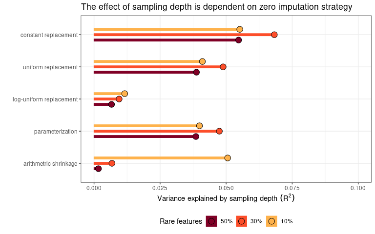

``` r
set.seed(12345)
library(tidyverse)
library(deleuze)
library(patchwork)
library(Tjazi)
library(vegan)
```

``` r
x <- 0
y <- 1
fib <- c()
while (x < 2000 & y < 2000){
  x <- x + y
  y <- x + y
  fib = c(fib, x, y)
}


res_fib = sapply(X = rep(seq(1000,10000, by = 1000), each = 100),FUN = function(x){
  table(factor(sample(paste0("size_",fib), prob = fib, replace = T,size = x ),levels = paste0("size_",fib)))
  
})

colnames(res_fib) = paste0(rep(seq(1000,10000, by = 1000), each = 100))


dist_logunif <- res_fib %>%
  data.frame() %>%
  Tjazi::clr_logunif() %>%
  t() %>%
  dist(x = ., method = "euclidean")  

dist_const <- res_fib %>%  
  data.frame() %>%
  Tjazi::clr_c() %>%
  t() %>%
  dist(x = ., method = "euclidean")  

dist_unif <- res_fib %>%
  data.frame() %>%
  Tjazi::clr_unif() %>%
  t() %>%
  dist(x = ., method = "euclidean")  

dist_shrunk <- res_fib %>%
  data.frame() %>%
  sCLR() %>%
  t() %>%
  dist(x = .,method = "euclidean")

dist_new <- res_fib %>% 
  data.frame() %>%
  getTableMeans() %>%
  t() %>%
  dist(x = ., method = "euclidean")


groups = rep(seq(1000,10000, by = 1000), each = 100)

v1 <- vegan::adonis2(dist_const   ~ groups, method = "euclidean", permutations = 1000)
v2 <- vegan::adonis2(dist_unif    ~ groups, method = "euclidean", permutations = 1000)
v3 <- vegan::adonis2(dist_logunif ~ groups, method = "euclidean", permutations = 1000)
v4 <- vegan::adonis2(dist_new     ~ groups, method = "euclidean", permutations = 1000)
v5 <- vegan::adonis2(dist_shrunk  ~ groups, method = "euclidean", permutations = 1000)

adonis_df <- data.frame(R2 =     c(v1$R2[1], v2$R2[1], v3$R2[1], v4$R2[1], v5$R2[1]), 
                        method = factor(c("constant replacement", "uniform replacement", "log-uniform replacement", "parameterization", "arithmetric shrinkage"), 
                                        levels = rev(c("constant replacement", "uniform replacement", "log-uniform replacement", "parameterization", "arithmetric shrinkage"))))

ggplot(adonis_df) +
  aes(x = R2, y = method) + 
  geom_segment(size = sqrt(2), x = 0, aes(xend = R2, yend = method), col = "black") +
  geom_segment(size = 1, x = 0, aes(xend = R2, yend = method), col = "red")+
  geom_point(size = 5, shape = 21, fill = "red") +
  
  theme_bw() +
  scale_x_continuous(limits = c(0,0.25)) +
  ylab("") + 
  xlab(Variance~explained~by~sampling~depth~(R^2)) +
  ggtitle("The effect of sampling depth is dependent on zero imputation strategy")
```

<!-- -->
