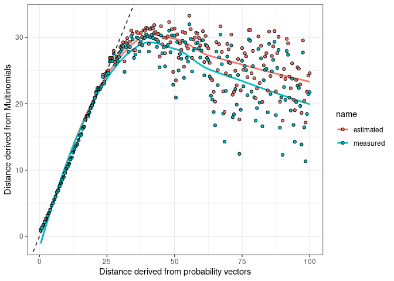

Maximally detectable Aitchison distance between samples from count data
may be bounded by  
1) number of features - because big distances require some features to
be proportionally very low, making them meaninglessly close to zero for
sampling purposes

2)  sequencing depth - more likely to have very low values be zero and
    thus indistinguishable from other very low values

This is likely not unique to Aitchison distance but rather due to the
nature of sampling.

q: can we determine maximum distance for a given depth and number of
features?

``` r
library(deleuze)
library(tidyverse)
```

    ## ── Attaching packages ─────────────────────────────────────── tidyverse 1.3.1 ──

    ## ✔ ggplot2 3.3.6     ✔ purrr   0.3.4
    ## ✔ tibble  3.1.7     ✔ dplyr   1.0.9
    ## ✔ tidyr   1.2.0     ✔ stringr 1.4.0
    ## ✔ readr   2.1.2     ✔ forcats 0.5.1

    ## ── Conflicts ────────────────────────────────────────── tidyverse_conflicts() ──
    ## ✖ dplyr::filter() masks stats::filter()
    ## ✖ dplyr::lag()    masks stats::lag()

``` r
library(LaplacesDemon)
```

    ## 
    ## Attaching package: 'LaplacesDemon'

    ## The following object is masked from 'package:purrr':
    ## 
    ##     partial

``` r
sampled <- sapply(X = seq(1/2,100, by = 1/2), 
       FUN = function(x){perturb_by_relab(rep(1, 100), by = x)}) %>% 
  cbind(b1 = rep(1, 100), .) %>% 
  
  #This one skews the curve!!
  #getTableMeans(., CLR_transformed = F) %>% 
  
  apply(X = ., 
        MARGIN = 2, 
        FUN = function(y){rmultinom(n = 1, size = 50000, prob = y)}
  ) 


  
estimated = apply(data.frame(sampled[,-1]), 
                 MARGIN = 2, 
                 FUN = function(z){sampleAitchison(samples = 500, x = z, y = sampled[,1]) %>% 
                     mean}
                 )

measured = sampled %>% 
  getTableMeans() %>% 
  t() %>% 
  dist() %>% 
  as.matrix %>%
  data.frame() %>% 
  rownames_to_column() %>% .$b1

data.frame(source = seq(1/2, 100, 1/2), 
           estimated = estimated, 
           measured = measured[-1]) %>% 
  pivot_longer(!source) %>% 
  
  ggplot() +
  aes(x = source, y = value, fill = name) +
  geom_smooth(aes(colour = name), se = F)+
  geom_point(shape = 21) + 
  geom_abline(intercept = 0, slope = 1, linetype = "dashed") +
  theme_bw() + ylab("Distance derived from Multinomials") + xlab("Distance derived from probability vectors")
```

    ## `geom_smooth()` using method = 'loess' and formula 'y ~ x'

<!-- -->
